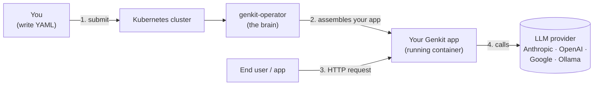
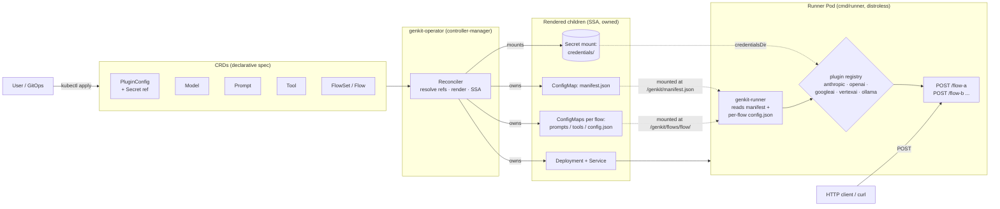

# genkit-operator
// TODO(user): Add simple overview of use/purpose

## Description
// TODO(user): An in-depth paragraph about your project and overview of use

## Architecture

### The big picture (no Kubernetes knowledge required)

You write a short YAML file that says *"I have these prompts, this model,
and these flows"*. You hand it to the cluster. The operator reads it,
packages everything together, starts your Genkit app, and gives you an
HTTP endpoint per flow. That's it.



What you provide:

* **Prompts** — the text instructions for the model.
* **Model** — which provider + model name to use (e.g. Claude Opus).
* **PluginConfig** — credentials (an API key) for the provider.
* **Flow / FlowSet** — *"glue these prompts + this model together and serve
  them at an HTTP route"*.

What you get back: a URL per flow (`POST /<flow-name>`) you can `curl` or
call from any client. No Dockerfiles to write, no servers to wire up, no
credential plumbing — the operator does all of that.

### Detailed view (what actually happens inside Kubernetes)



## Getting Started

### Prerequisites
- go version v1.24.6+
- docker version 17.03+.
- kubectl version v1.11.3+.
- Access to a Kubernetes v1.11.3+ cluster.

### Test it locally on Kind

The fastest way to try the operator end-to-end is against a
[kind](https://kind.sigs.k8s.io/) cluster. The Makefile ships a one-shot
target that builds both images, loads them into kind, installs the CRDs,
and deploys the controller.

```sh
# 1. Create a kind cluster named "genkit" (matches the default KIND_CLUSTER).
kind create cluster --name genkit

# 2. Build manager + runner images, load them into kind, install CRDs, deploy.
make kind-deploy IMG=genkit-operator:dev

# 3. Apply the sample CRs (FlowSet, Model, PluginConfig, Prompt, ...).
kubectl apply -k config/samples/

# 4. Watch the controller and the rendered workloads.
kubectl -n genkit-operator-system logs deploy/genkit-operator-controller-manager -c manager -f
kubectl get flowset,flow,model,pluginconfig,prompt
```

To iterate on changes, re-run `make kind-deploy IMG=genkit-operator:dev`
(the image tag stays the same; the controller deployment is patched in
place). To redeploy only the runner image after editing `cmd/runner`,
run `make runner-kind-load` and then
`kubectl rollout restart deploy/<flowset-name>`.

Override the cluster name with `KIND_CLUSTER=<name>` on any target:

```sh
make kind-deploy IMG=genkit-operator:dev KIND_CLUSTER=my-cluster
```

### To Deploy on the cluster
**Build and push your image to the location specified by `IMG`:**

```sh
make docker-build docker-push IMG=<some-registry>/genkit-operator:tag
```

### Build and publish the Genkit runner image

`Flow` and `FlowSet` Pods run the reference runtime built from
`cmd/runner` (`Dockerfile.runner`). The runner image is what loads the
generated `manifest.json` / `config.json`, registers each flow, and
serves `POST /<flow>`. It is independent from the controller image and
has its own Makefile targets so you can iterate on the runtime without
rebuilding the operator.

The runner image tag is controlled by `RUNNER_IMG` (default
`genkit-runner:dev`).

**Build only:**

```sh
make runner-build RUNNER_IMG=<some-registry>/genkit-runner:tag
```

**Build + push to a registry:**

```sh
make runner-build runner-push RUNNER_IMG=<some-registry>/genkit-runner:tag
```

**Build + load into a local kind cluster (no registry required):**

```sh
make runner-kind-load RUNNER_IMG=genkit-runner:dev KIND_CLUSTER=genkit
```

**Use the image in a Flow / FlowSet:** set `spec.image` to the same
value you passed as `RUNNER_IMG`:

```yaml
apiVersion: genkit.dev/v1alpha1
kind: FlowSet
metadata:
  name: greeting-suite
spec:
  image: genkit-runner:dev    # must match RUNNER_IMG
  # ... flows, env, etc.
```

**Pick up code changes:** because Docker may cache stale layers when
only Go source files change, rebuild with `--no-cache` and restart the
workload:

```sh
docker build --no-cache -t genkit-runner:dev -f Dockerfile.runner .
kind load docker-image genkit-runner:dev --name genkit
kubectl rollout restart deploy/<flowset-or-flow-name>
```

**NOTE:** This image ought to be published in the personal registry you specified.
And it is required to have access to pull the image from the working environment.
Make sure you have the proper permission to the registry if the above commands don’t work.

**Install the CRDs into the cluster:**

```sh
make install
```

**Deploy the Manager to the cluster with the image specified by `IMG`:**

```sh
make deploy IMG=<some-registry>/genkit-operator:tag
```

> **NOTE**: If you encounter RBAC errors, you may need to grant yourself cluster-admin
privileges or be logged in as admin.

**Create instances of your solution**
You can apply the samples (examples) from the config/sample:

```sh
kubectl apply -k config/samples/
```

>**NOTE**: Ensure that the samples has default values to test it out.

### To Uninstall
**Delete the instances (CRs) from the cluster:**

```sh
kubectl delete -k config/samples/
```

**Delete the APIs(CRDs) from the cluster:**

```sh
make uninstall
```

**UnDeploy the controller from the cluster:**

```sh
make undeploy
```

## Project Distribution

Following the options to release and provide this solution to the users.

### By providing a bundle with all YAML files

1. Build the installer for the image built and published in the registry:

```sh
make build-installer IMG=<some-registry>/genkit-operator:tag
```

**NOTE:** The makefile target mentioned above generates an 'install.yaml'
file in the dist directory. This file contains all the resources built
with Kustomize, which are necessary to install this project without its
dependencies.

2. Using the installer

Users can just run 'kubectl apply -f <URL for YAML BUNDLE>' to install
the project, i.e.:

```sh
kubectl apply -f https://raw.githubusercontent.com/<org>/genkit-operator/<tag or branch>/dist/install.yaml
```

### By providing a Helm Chart

1. Build the chart using the optional helm plugin

```sh
kubebuilder edit --plugins=helm/v2-alpha
```

2. See that a chart was generated under 'dist/chart', and users
can obtain this solution from there.

**NOTE:** If you change the project, you need to update the Helm Chart
using the same command above to sync the latest changes. Furthermore,
if you create webhooks, you need to use the above command with
the '--force' flag and manually ensure that any custom configuration
previously added to 'dist/chart/values.yaml' or 'dist/chart/manager/manager.yaml'
is manually re-applied afterwards.

## Contributing
// TODO(user): Add detailed information on how you would like others to contribute to this project

**NOTE:** Run `make help` for more information on all potential `make` targets

More information can be found via the [Kubebuilder Documentation](https://book.kubebuilder.io/introduction.html)

## License

Copyright 2026 Xavier Portilla Edo.

Licensed under the Apache License, Version 2.0 (the "License");
you may not use this file except in compliance with the License.
You may obtain a copy of the License at

    http://www.apache.org/licenses/LICENSE-2.0

Unless required by applicable law or agreed to in writing, software
distributed under the License is distributed on an "AS IS" BASIS,
WITHOUT WARRANTIES OR CONDITIONS OF ANY KIND, either express or implied.
See the License for the specific language governing permissions and
limitations under the License.

